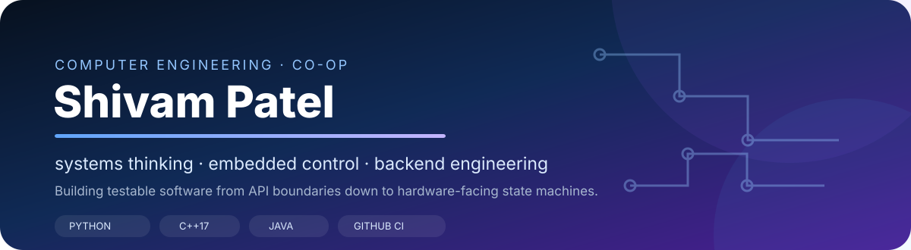
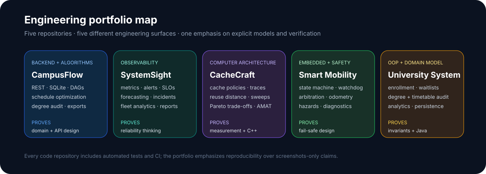

  

  
  
  
  
  

## Hi — I'm Shivam

I'm a **Computer Engineering Co-op student at the University of Guelph** interested in the boundary between software and physical/computing systems: embedded control, backend services, computer architecture, observability, and reliable stateful applications.

My portfolio is intentionally not five copies of the same web app. Each repository attacks a different engineering surface and is built to show the parts that are harder to fake in a screenshot: **domain rules, algorithms, failure behavior, testability, architecture trade-offs, and cross-platform verification.**

  <a href="https://github.com/shiv814/campusflow-api"><b>CampusFlow</b></a> ·
  <a href="https://github.com/shiv814/systemsight-monitor"><b>SystemSight</b></a> ·
  <a href="https://github.com/shiv814/cachecraft-simulator"><b>CacheCraft</b></a> ·
  <a href="https://github.com/shiv814/smart-mobility-controller"><b>Smart Mobility</b></a> ·
  <a href="https://github.com/shiv814/university-management-system"><b>University System</b></a>

---

## Featured engineering work

<table>
<tr>
<td width="50%" valign="top">

### 🎓 [CampusFlow API](https://github.com/shiv814/campusflow-api)

**Python · SQLite · REST · graph algorithms**

Academic-planning platform that combines a persistent course catalog with prerequisite reasoning and schedule constraints.

**V3 engineering:** prerequisite DAG validation, cycle detection, topological/critical-path analysis, bottleneck scoring, deterministic multi-term schedule optimization, degree auditing, iCalendar export, responsive HTML planning reports, API client + retries.

**What it demonstrates:** backend boundaries, data modeling, migrations, graph algorithms, constrained optimization, defensive HTTP handling.

</td>
<td width="50%" valign="top">

### 📡 [SystemSight Monitor](https://github.com/shiv814/systemsight-monitor)

**Python · psutil · observability · HTTP**

Cross-platform host-observability toolkit that turns system telemetry into health and reliability signals.

**V3 engineering:** composable metric rules, linear/EWMA forecasting, capacity projections, flat-baseline anomaly handling, SLO/error-budget math, fleet aggregation, incident timelines, dark-mode HTML reports with inline SVG trends.

**What it demonstrates:** operational thinking, time-series reasoning, alert-state design, portability, deterministic test doubles.

</td>
</tr>
<tr>
<td width="50%" valign="top">

### 🧠 [CacheCraft Simulator](https://github.com/shiv814/cachecraft-simulator)

**C++17 · CMake · computer architecture**

Policy-aware cache simulator and experiment toolkit for understanding memory-system trade-offs against different workloads.

**V3 engineering:** workload characterization, reuse-distance analysis, deterministic synthetic traces, multi-configuration sweeps, miss-rate/AMAT/traffic metrics, Pareto-frontier selection, CSV/JSON experiment output.

**What it demonstrates:** modern C++, architecture fundamentals, deterministic simulation, performance measurement, multi-objective engineering trade-offs.

</td>
<td width="50%" valign="top">

### ♿ [Smart Mobility Controller](https://github.com/shiv814/smart-mobility-controller)

**C++17 · Arduino · embedded control**

Safety-oriented motion-control prototype built around explicit fail-safe behavior rather than just motor output.

**V3 engineering:** priority/TTL command arbitration, emergency override, battery reserve/range estimation, differential odometry, read-only safety diagnostics, hazard analysis, deterministic validation scenarios.

**What it demonstrates:** state machines, watchdogs/interlocks, hardware/software boundaries, safety documentation, scenario-based verification.

> Portfolio prototype — not certified medical-device software.

</td>
</tr>
</table>

### 🏫 [University Management System](https://github.com/shiv814/university-management-system)

**Java 17/21 · OOP · algorithms · persistence**

Academic-record application that treats enrollment as a lifecycle with prerequisites, capacity, FIFO waitlists, completion, transcripts/GPA and durable CSV restoration.

**V3 engineering:** immutable degree requirements, degree-progress audits, deterministic timetable optimization, demand/capacity analytics, prerequisite data-quality auditing, and a generated responsive portfolio dashboard.

**What it demonstrates:** domain invariants, immutable value modeling, collection design, backtracking search, analytics, persistence and platform-independent Java tooling.

---

## Proof, not just feature lists

| Repository | Automated verification |
|---|---|
| **CampusFlow** | Python 3.10, 3.11, 3.12 and 3.13; domain + HTTP + graph/optimizer/export tests |
| **SystemSight** | Python 3.10/3.12 across Linux, Windows and macOS; tests + offline demo/report generation |
| **CacheCraft** | Debug + Release across Linux, Windows and macOS; core tests + analysis tests + experiment smoke run |
| **Smart Mobility** | Debug + Release across Linux, Windows and macOS; controller + safety-module tests + demo smoke run |
| **University System** | Java 17 + 21 across Linux, Windows and macOS; original + advanced v3 checks + HTML demo generation |

I use CI here as part of the design constraint: portable code, deterministic tests, and reproducible demos are more useful portfolio evidence than a claim that something “works on my machine.”

## Technical toolkit

| Area | Technologies / concepts |
|---|---|
| **Languages** | Python, C++, Java, C, SQL, HTML/CSS |
| **Backend / data** | REST/JSON, SQLite, CSV persistence, HTTP servers, schema migrations |
| **Systems** | observability, process/system metrics, memory hierarchy, cache policies, time-series signals |
| **Embedded** | Arduino, differential drive, watchdogs, interlocks, PWM control, odometry, telemetry |
| **Algorithms** | graph traversal, topological ordering, backtracking, scheduling, Pareto filtering, anomaly detection |
| **Engineering workflow** | Git, GitHub Actions, CMake, pytest, javac lint-as-error, cross-platform CI |

## How I approach engineering problems

**Model the state first.** I prefer named states, records, invariants and explicit transitions over scattered booleans and implicit assumptions.

**Separate mutation from analysis.** The projects increasingly isolate core state changes from analytics, reporting and visualization so those layers can be tested independently.

**Test failure paths.** Missing prerequisites, cache misses, stale commands, full capacity, sensor faults, alert escalation and bad input are first-class scenarios—not edge cases to ignore.

**Make trade-offs visible.** Documentation explains why a lightweight SQLite/CSV solution is appropriate for a portfolio scope, where a real deployment would require different infrastructure, and where safety/regulatory claims explicitly stop.

## Currently interested in

- embedded/software co-op roles
- controls and automation software
- systems programming and computer architecture
- backend/platform engineering
- observability and reliability engineering
- hardware/software integration

## More detail

The [portfolio engineering matrix](docs/PROJECT_MATRIX.md) compares the five projects by problem, strongest engineering signal, and verification approach.

## Contact

**Shivam Patel** · Computer Engineering Co-op · University of Guelph  
📧 `pateshiv16@gmail.com`  
🔗 [github.com/shiv814](https://github.com/shiv814)
